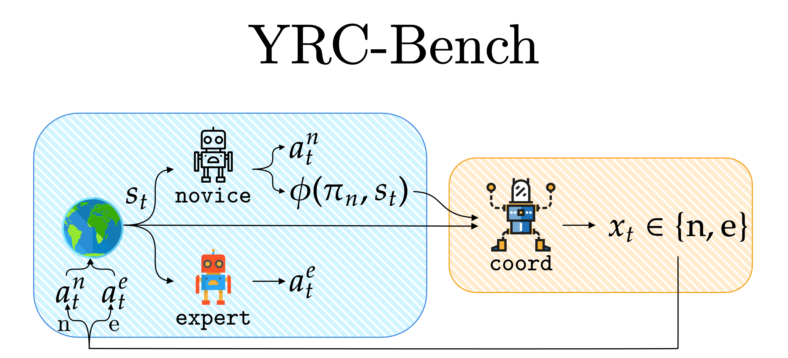

<p align="center">
    
</p>

YRC-Bench is a benchmark for learning a coordination strategy the problem of yielding and requesting control between novice (weak) and expert (strong) policies. The benchmark is designed to train and evaluate the performance of the coordination policy in a variety of environments, algorithms, and feature types. The benchmark is designed to be modular and extensible, allowing for easy integration of new environment suites, algorithms, and feature types.

For further details, check the paper: https://arxiv.org/abs/2502.09583

### Supported Suites
- MiniGrid:
  - Forked from the `Farama-Foundation/Minigrid` with minor changes: https://github.com/modanesh/Minigrid/tree/1eae02b3561e0cce827d0509d904d053f437b08c
- Procgen:
  - Containing the "Goal Misgeneralization" environments from the original Procgen: https://github.com/JacobPfau/procgenAISC/tree/7821f2c00be9a4ff753c6d54b20aed26028ca812 
- Cliport:
  - Forked from the `cliport/cliport` with minor changes: https://github.com/modanesh/cliport/tree/ff9fe042c0c2bf0d98c6354d3b5ce2a0a8de97c2
  - Useful link for cliport's installation: https://medium.com/@limyoonaxi/common-bugs-you-may-encounter-while-installing-cliport-ef1790e1cc0a

### Supported Algorithms
- Random: randomly selecting the agent to query
- Always: always querying the same agent
- Threshold-based: querying the agent based on a threshold over one of maximum logit, maximum probability, margin, negative entropy, or negative energy
- RL-based: training an RL agent to learn the coordination strategy (PPO)
- OOD detection-based: querying the agent based on the out-of-distribution detection score (DeepSVDD)


### Supported Feature Types
For RL-based and OOD detection-based algorithms, the following feature types are supported as the input:
- Raw image observations
- Weak agent's hidden features
- Weak agent's action distributions
- Raw image observations + Weak agent's hidden features
- Raw image observations + Weak agent's action distributions
- Weak agent's hidden features + Weak agent's action distributions
- Raw image observations + Weak agent's hidden features + Weak agent's action distributions

### Installation
1. Clone the repository:
```bash
git clone https://github.com/modanesh/YRC-Bench.git
cd YRC-Bench
git submodule update --init --recursive
```

2. Create a virtual environment and source it:
```bash
virtualenv -p python3.8 venv
source venv/bin/activate
```

3. Install the requirements:
```bash
pip install -r requirements.txt
```
Note: the requirements for MiniGrid environments is different from the other environments. To install the requirements for MiniGrid, run the following command:
```bash
pip install -r requirements_minigrid.txt
```

4. Install the environments:
```bash
pip install -e lib/LIBRARY_NAME
```
where `LIBRARY_NAME` is the name of the library you want to install from the `lib` directory.

### Usage
#### Training
First checkpoints for the acting policies should be provided. For the acting policies (sim weak, weak, and strong), the checkpoints should be located in the `YRC/checkpoints` directory. The checkpoints for each environment suite are obtained by:
- MiniGrid: Training RL policies using https://github.com/lcswillems/rl-starter-files
- Procgen: Training RL policies using https://github.com/jbkjr/train-procgen-pytorch
- Cliport: The provided checkpoints in the `cliport` repository https://github.com/cliport/cliport

A zip file containing the checkpoints for the acting policies can be downloaded from the following link: [Google Drive Link](https://drive.google.com/file/d/1Tix3PO8gwJljwHLcolaQo5Moaci-apF8/view?usp=sharing)


---

Once the acting policies are set, to train an algorithm on an environment with a specific feature type, run the following command:
```bash
python train.py -c configs/CONFIG.yaml -n RUN_NAME -en ENV_NAME -sim PATH/TO/SIM_WEAK_AGENT.pt -weak PATH/TO/WEAK_AGENT.pt -strong PATH/TO/STRONG_AGENT.pt -query_cost QUERY_COST -cp_feature FEATURE_TYPE
```
where `CONFIG.yaml` is the configuration file, `RUN_NAME` is the name of the run, `ENV_NAME` is the name of the environment, `PATH/TO/SIM_WEAK_POLICY.pt` is the path to the simulated weak policy, `PATH/TO/WEAK_POLICY.pt` is the path to the weak policy, `PATH/TO/STRONG_POLICY.pt` is the path to the strong policy, `QUERY_COST` is the cost of querying the strong agent, and `FEATURE_TYPE` is the input feature type for OOD- and RL-based methods. For other methods, there is no need to specify `cp_feature`. For a full list of arguments, run `python train.py -h` or check the `flags.py` file.

During the training, 3 checkpoints are saved: best_val_sim.ckpt, best_val_true.ckpt, and last.ckpt. The best_val_sim.ckpt is the checkpoint with the best validation performance on the simulated case, the best_val_true.ckpt is the checkpoint with the best validation performance on the true case, and the last.ckpt is the last checkpoint of the training.


---

Following are a few examples of training commands for different settings:
- Training a random algorithm on the MiniGrid's DoorKey environment with query cost `0.2`:
```bash
python train.py -c configs/minigrid_random.yaml -n DoorKey_always_random_qc02 -en MiniGrid-DoorKey -sim YRC/checkpoints/minigrid/DoorKey/sim_weak/status.pt -weak YRC/checkpoints/minigrid/DoorKey/weak/status.pt -strong YRC/checkpoints/minigrid/DoorKey/strong/status.pt -query_cost 0.2 -en_tr_suffix=-5x5-v0 -en_te_suffix=-8x8-v0
```
- Training a threshold-based algorithm on the Procgen's coinrun environment with query cost `0.6` and margin as the coordination policy metric:
```bash
python train.py -c configs/procgen_threshold.yaml -n coinrun_threshold_margin_qc06 -en coinrun -sim YRC/checkpoints/procgen/coinrun/sim_weak/model_40009728.pth -weak YRC/checkpoints/procgen/coinrun/weak/model_80019456.pth -strong YRC/checkpoints/procgen/coinrun/strong/model_200015872.pth -cp_metric margin -query_cost 0.6
```
- Training an OOD detection-based algorithm on the cliport's stack-block-pyramid-seq environment with query cost `0.0` and raw image observations as the input feature type:
```bash
python train.py -c configs/cliport_ood.yaml -n stack-block-pyramid-seq_ood_obs_qc00 -en stack-block-pyramid-seq -sim YRC/checkpoints/cliport/multi-language-conditioned-cliport-n10-train/checkpoints/steps=400000-val_loss=0.00016243.ckpt -weak YRC/checkpoints/cliport/multi-language-conditioned-cliport-n100-train/checkpoints/steps=300000-val_loss=0.00017400.ckpt -cp_feature obs -cp_method DeepSVDD -query_cost 0
```
*Note: For the cliport's environments, the strong agent is created based on the task (oracle), so there is no need to give it as input.*
- Training an RL-based algorithm on the Procgen's maze environment with query cost `1.0` and raw image observation + hidden features as the input feature type:
```bash
python train.py -c configs/procgen_skyline.yaml -n maze_rl_hidden_obs_qc10 -en maze -sim YRC/checkpoints/procgen/maze/sim_weak/model_40009728.pth -weak YRC/checkpoints/procgen/maze/weak/model_80019456.pth -strong YRC/checkpoints/procgen/maze/strong/model_200015872.pth -wandb -cp_feature hidden_obs -query_cost 1.0
```


#### Evaluation
To evaluate the trained model, run the following command:
```bash
python eval.py -c configs/CONFIG.yaml -n RUN_NAME -en ENV_NAME -sim PATH/TO/SIM_WEAK_AGENT.pt -weak PATH/TO/WEAK_AGENT.pt -strong PATH/TO/STRONG_AGENT.pt -query_cost QUERY_COST -cp_feature FEATURE_TYPE -f_n CHECKPOINT_NAME -seed SEED
```
where `CONFIG.yaml` is the configuration file, `RUN_NAME` is the name of the run, `ENV_NAME` is the name of the environment, `PATH/TO/SIM_WEAK_POLICY.pt` is the path to the simulated weak policy, `PATH/TO/WEAK_POLICY.pt` is the path to the weak policy, `PATH/TO/STRONG_POLICY.pt` is the path to the strong policy, `QUERY_COST` is the cost of querying the strong agent, `FEATURE_TYPE` is the input feature type for OOD- and RL-based methods, `CHECKPOINT_NAME` is the name of the checkpoint to evaluate, and `SEED` is the random seed. For a full list of arguments, run `python eval.py -h` or check the `flags.py` file.

---

Following are a few examples of evaluation commands for different settings:
- Evaluating a random algorithm on the MiniGrid's DoorKey environment with query cost `0.2` and `best_val_sim.ckpt` checkpoint:
```bash
python eval.py -c configs/minigrid_random.yaml -n DoorKey_always_random_qc02 -en MiniGrid-DoorKey -sim YRC/checkpoints/minigrid/DoorKey/sim_weak/status.pt -weak YRC/checkpoints/minigrid/DoorKey/weak/status.pt -strong YRC/checkpoints/minigrid/DoorKey/strong/status.pt -query_cost 0.2 -en_tr_suffix=-5x5-v0 -en_te_suffix=-8x8-v0 -f_n best_val_sim.ckpt -seed 10
```
- Evaluating a threshold-based algorithm on the Procgen's coinrun environment with query cost `0.6` and `best_val_true.ckpt` checkpoint:
```bash
python eval.py -c configs/procgen_threshold.yaml -n coinrun_threshold_margin_qc06 -en coinrun -sim YRC/checkpoints/procgen/coinrun/sim_weak/model_40009728.pth -weak YRC/checkpoints/procgen/coinrun/weak/model_80019456.pth -strong YRC/checkpoints/procgen/coinrun/strong/model_200015872.pth -cp_metric margin -f_n best_val_true.ckpt -query_cost 0.6 -seed 12
```

### Analyzing the Results
All the scripts required to analyze the results are located in the `analyzing` directory. The scripts are designed to analyze the results of the experiments and generate the plots and tables presented in the paper. To do so, once the experiments are done, run the following command first to extract the raw results from the `experiments` directory:
```bash
python parse.py
```
This will create a file named `raw_results.json` in the `analyzing` directory. Then, run the following command to aggregate the results:
```bash
python aggregate.py
```
This will create a file named `aggregated_results.json` in the `analyzing` directory. Finally, to reproduce the plots and tables, run any of the other scripts in the `analyzing` directory. Each will store the generated plots and tables in the `final_plots` sub-directory.


### Extending the Benchmark
To extend the benchmark with a new environment suite, follow the steps discussed in the "[Add a new environment suite to the benchmark](https://github.com/modanesh/yield_request_control/wiki/Add-a-new-suite-to-the-benchmark)" wiki page.
Also, to extend the benchmark with a new algorithm or feature type, follow the steps discussed in the "[Add a new algorithm to the benchmark](https://github.com/modanesh/yield_request_control/wiki/Add-a-new-suite-to-the-benchmark)" wiki page.

### Citation
If you use this benchmark in your research, please cite the following:
```bibtex
@misc{danesh2025learningcoordinateexperts,
      title={Learning to Coordinate with Experts}, 
      author={Mohamad H. Danesh and Tu Trinh and Benjamin Plaut and Nguyen X. Khanh},
      year={2025},
      eprint={2502.09583},
      archivePrefix={arXiv},
      primaryClass={cs.LG},
      url={https://arxiv.org/abs/2502.09583}, 
}
```
```bibtex
@misc{yrc-bench,
      author = {Danesh, Mohamad H. and Nguyen, Khanh Xuan},
      title = {YRC-Bnech: A Benchmark for Learning to Coordinate with Experts},
      year = {2025},
      publisher = {GitHub},
      journal = {GitHub repository},
      howpublished = {\url{https://github.com/modanesh/yield_request_control}},
    }
```
